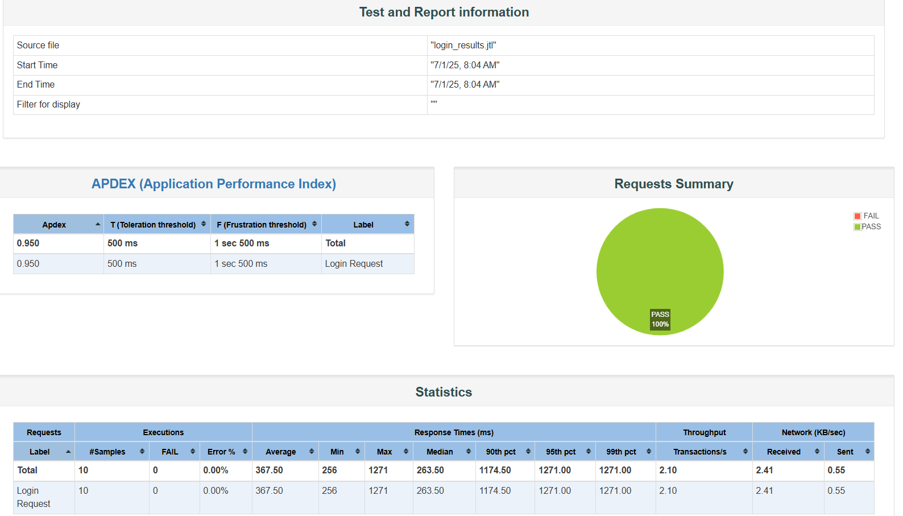

# OrangeHRM Testing Suite

Automated testing project for the [OrangeHRM Open Source](https://opensource-demo.orangehrmlive.com/) system using WebdriverIO.

 Project Goals

- Automate key UI workflows such as login and dashboard navigation.
- Extend to API testing using Postman.
- Perform load testing using JMeter.
- Practice Page Object Model (POM) design pattern.

---
 Tech Stack

-  WebdriverIO (JavaScript)
-  Mocha Test Framework
-  Chromedriver
-  Node.js & NPM
-  Git & GitHub

---
 API Testing (Postman)

-  Login (POST)
-  Get Employees (GET)
- Create Employee (POST)
 - Delete Employee (DELETE)
 Postman Collection available in [`/api`](./api)
-----
Performance Report (JMeter)

Simulated 10 users logging into the login API endpoint using JMeter.

 Below is a sample from the HTML report generated:



-------
 How to Run the Tests

1. Install dependencies:
   ```bash
   npm install
